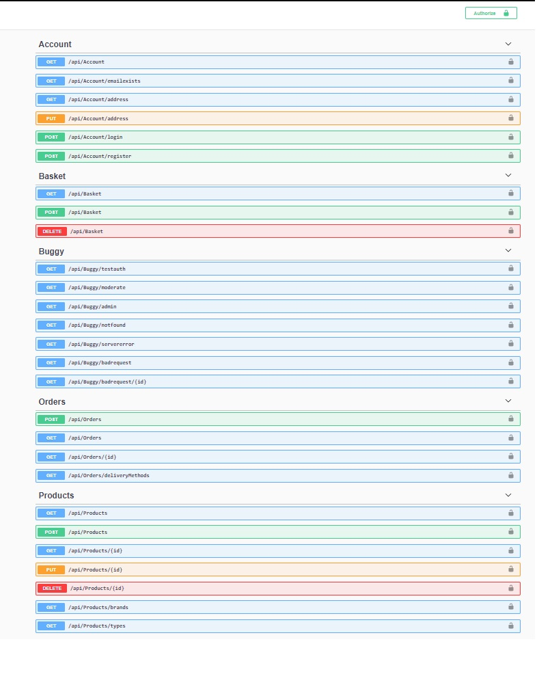
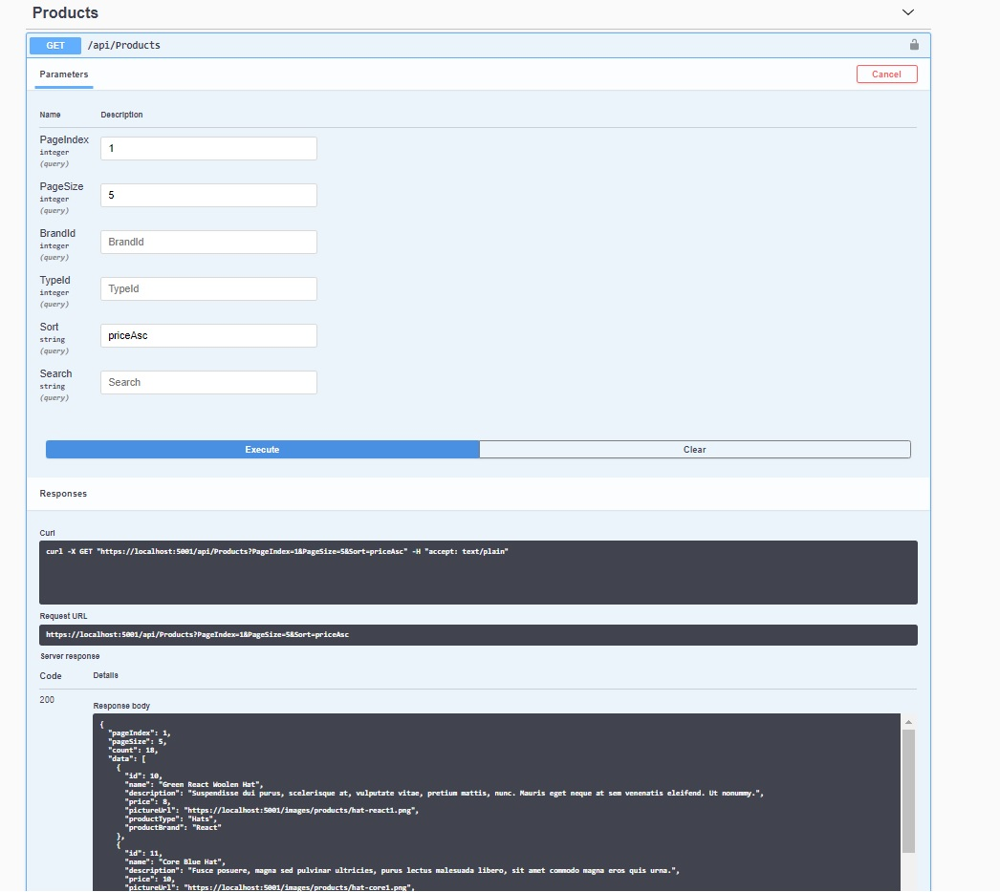

# Asp .Net Core 購物網站後端
購物網站後端實作練習

# 簡介
使用 Restful Web API, 商品CRUD、分類、登入/登出，使用者權限。

# API

# 技術

* Asp .Net Core
* Repository
* SqlLite

# 套件

* DependencyInjection
* Swagger
* AspNetCore.Identity
* IdentityModel.Tokens.Jwt
* StackExchange.Redis
